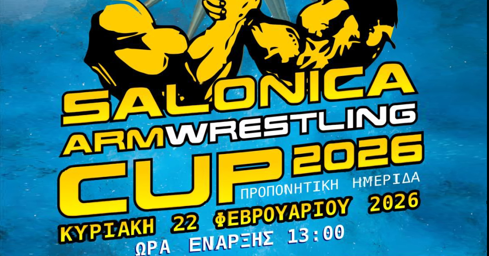

# Salonica Armwrestling Cup 2026



> **Προπονητική Ημερίδα Χειροπάλης**  
> 📅 Κυριακή 22 Φεβρουαρίου 2026  
> 📍 Κλειστό Γυμναστήριο 1ου Γυμνασίου Ευκαρπίας, Θεσσαλονίκη

---

## 🌐 Live Website

**URL:** [https://sac2026.vercel.app](https://sac2026.vercel.app)

---

## 👨‍💻 Author

**Georgios-Chrysovalantis Chatzivantsidis**

---

## 🛠️ Tech Stack & Implementation

This project showcases modern web development practices and technologies:

### Core Technologies

| Technology | Purpose | Implementation |
|------------|---------|----------------|
| **HTML5** | Semantic Structure | SEO-optimized semantic markup with proper heading hierarchy and accessibility attributes |
| **Tailwind CSS** | Styling | Utility-first CSS framework for rapid, responsive design with custom configuration |
| **Vanilla JavaScript** | Interactivity | Custom i18n (internationalization) system with language switching (Greek/English) |
| **Google Fonts** | Typography | Noto Sans Greek & Inter for optimal Greek/English text rendering |

### Key Features Implemented

#### 🌍 Internationalization (i18n)
- **Custom JavaScript translation system** with `data-i18n` attributes
- **LocalStorage persistence** for user language preference
- **Dynamic content switching** without page reload
- **Bilingual support** (Greek/English) for all UI elements

```javascript
// Language switching implementation
const translations = {
    el: { /* Greek translations */ },
    en: { /* English translations */ }
};

function setLanguage(lang) {
    document.querySelectorAll('[data-i18n]').forEach(el => {
        const key = el.getAttribute('data-i18n');
        if (translations[lang][key]) {
            el.textContent = translations[lang][key];
        }
    });
}
```

#### 📱 Responsive Design
- **Mobile-first approach** with Tailwind CSS breakpoints
- **Flexible grid layouts** using CSS Grid and Flexbox
- **Touch-friendly UI** with minimum 44px tap targets
- **Optimized images** with proper aspect ratios

#### 🎨 UI/UX Design
- **Custom color palette** with brand colors (blue/gold theme)
- **Gradient effects** using CSS linear-gradients
- **Glassmorphism** with backdrop-blur effects
- **Smooth animations** with CSS transitions
- **Card-based layout** with hover effects

#### 🔍 SEO & Social Media
- **Open Graph meta tags** for Facebook sharing
- **Twitter Card meta tags** for Twitter previews
- **Structured content** with proper meta descriptions
- **Semantic HTML5** elements for better search engine indexing

```html
<!-- Open Graph implementation -->
<meta property="og:type" content="website">
<meta property="og:title" content="Salonica Armwrestling Cup 2026">
<meta property="og:image" content="https://sac2026.vercel.app/share-image.jpg">
<meta property="og:image:width" content="1200">
<meta property="og:image:height" content="630">
```

### Performance Optimizations

- ✅ **CDN-hosted libraries** (Tailwind CSS, Google Fonts)
- ✅ **Optimized images** with proper formats
- ✅ **Minimal JavaScript** for fast loading
- ✅ **CSS-only animations** where possible
- ✅ **Lazy loading** ready for images

### Accessibility Features

- ✅ **ARIA labels** for interactive elements
- ✅ **Semantic HTML** for screen readers
- ✅ **Keyboard navigation** support
- ✅ **Color contrast** compliance
- ✅ **Responsive text** sizing

---

## 📁 Project Structure

```
SAC2026/
├── index.html              # Main HTML file
├── share-image.jpg         # Social media preview image
├── logo-makedonon-new.png  # Organizer logo
├── logo-sportfood.png      # Sponsor logos
├── logo-3dsolutions.png
├── logo-prime.jpg
├── logo-times.png
├── logo-ekdoseis-kyriakidi.png
├── logo-ufight.png
├── plamen-dimitrov.png     # Seminar instructor photo
├── armwrestling-table.jpg  # Facility photos
├── facility-1.jpg
├── facility-2.jpg
├── facility-3.jpg
├── hero-bg.jpg             # Hero background image
└── README.md               # This file
```

---

## 🚀 Deployment

### Platform: Vercel

- **Continuous Deployment** from GitHub
- **Automatic HTTPS** enabled
- **Global CDN** for fast loading
- **Custom domain** support (sac2026.vercel.app)

### Deployment Process

1. Push code to GitHub repository
2. Vercel automatically detects changes
3. Build and deploy process starts
4. Site is live within seconds

---

## 📋 Event Information

### 🏆 About the Tournament

The **Salonica Armwrestling Cup 2026** is organized by **Makedonon Athletic Club** in Thessaloniki, Greece. The event is open to athletes from all over Greece with multiple categories covering all age groups and experience levels.

### 📍 Venue

**Indoor Gymnasium of 1st Efkarpia High School**  
Palaion Patron Germanou 1, Efkarpia 564 29, Thessaloniki

[Open in Google Maps](https://maps.app.goo.gl/Q3vam5Ywp9feczBd9)

### 📅 Schedule

| Date | Event | Time |
|------|-------|------|
| **Saturday, Feb 21** | Weigh-in | 17:00 - 20:00 |
| **Saturday, Feb 21** | Plamen Dimitrov Seminar | 20:00 (20€) |
| **Sunday, Feb 22** | Weigh-in | 09:00 - 12:30 |
| **Sunday, Feb 22** | Competition Start | 13:00 |

### 💶 Entry Fees

| Category | One Hand | Both Hands |
|----------|----------|------------|
| Men, Women, Beginners, Master | 20€ | 15€/hand |
| Juniors | 15€ | 10€/hand |

### 📞 Contact

- **Phone:** +30 694 530 8111
- **Contact Person:** Kyriakos Evangeloudis
- **Facebook Event:** [Salonica Armwrestling Cup 2026](https://www.facebook.com/events/950607031468231)
- **Organizer Website:** [asmakedonon.gr](https://www.asmakedonon.gr/p/blog-page_81.html)

---

## 🤝 Sponsors

- SPORTFOOD
- 3DSolutions
- prime beauty salon
- TIMES cafe | bar
- Εκδόσεις Κυριακίδη
- **Communication Sponsor:** [Ufight.gr](https://ufight.gr)

---

## 📄 License

© 2026 Georgios-Chrysovalantis Chatzivantsidis
All rights reserved.

---

<p align="center">
  <strong>Developed by Georgios-Chrysovalantis Chatzivantsidis</strong><br>
  <em>Modern Web Development | Responsive Design | i18n Implementation</em>
</p>
